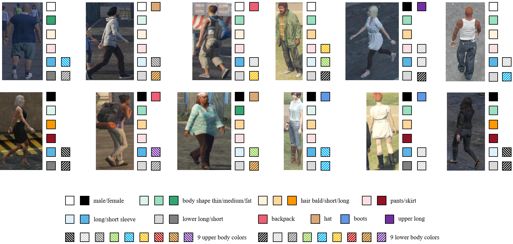

## AttMOT: Improving Multiple-Object Tracking by Introducing Auxiliary Pedestrian Attributes

[**AttMOT: Improving Multiple-Object Tracking by Introducing Auxiliary Pedestrian Attributes**](https://arxiv.org/abs/2308.07537) <br>
Yunhao Li, Zhen Xiao, Lin Yang, Dan Meng, Heng Fan, Libo Zhang <br>
[`arXiv`](https://arxiv.org/abs/2308.07537) `Dataset`

 <br>
**Figure**: We introduce AttMOT, a large, highly enriched synthetic dataset for pedestrian tracking, containing over 80k frames and 6 million pedestrian IDs with different time, weather conditions, and scenarios. To the best of our knowledge, AttMOT is the first MOT dataset with semantic attributes.

### 📷 Attribute Samples
 <br>
**Figure**: Visualization of several attribute annotation examples in the proposed AttMOT.

### 🚩 Usage
🔹 👉 **Organization**

Due to the large data size, we split VastTrack into multiple Zip files. Each file has the following organization:
``` text
part-01.zip
├── seq_001
│   └── det.txt
│   └── feature.txt
│   └── seqinfo.ini
│   └── 0.jpg
│   └── 1.jpg
│   └── 2.jpg
|   ...
part-02.zip
├── seq_101
|   ...
...
```

🔹 👉 **Format of Each Video Sequence**

In each video folder, we provide the frames of the video, bounding box annotations in the ```det.txt``` file, pedestrian attribute annotations in the ```feature.txt``` file, and basic information of the video sequence in the ```seqinfo.ini```. The format of the bounding box and video information remains consistent with the MOTChallenge dataset, which is also the mainstream annotation method in the MOT field.

🔹 👉 **Downloading Links**

In [AttMOT](https://arxiv.org/abs/2308.07537) we utilized a dataset containing 450 sequences. Subsequently, for further research purposes, we designed datasets with a larger number of sequences. Therefore, here we provide download links for three different versions of the dataset.：

- The downloading link for the ```450-seqs version``` is here.
- The downloading link for the ```600-seqs version``` is here.
- The downloading link for the ```1800-seqs version``` is here.

**Note**: Our dataset is a synthetic dataset, thus, it only consists of a training set and does not include a separate test set.

### 📏 Evaluation

AttMOT does not include a test set. Therefore, models trained on it are typically evaluated on existing real MOT datasets, such as [MOTChallenge](https://motchallenge.net/data/MOT17/) datasets, using the [TrackEval](https://github.com/JonathonLuiten/TrackEval) Evaluation Toolkit.

### 🎈 Citation
🙏 If you use AttMOT for your research, please consider giving it a star ⭐ and citing it:

``` text
@article{li2024attmot,
        title={AttMOT: Improving Multiple-Object Tracking by Introducing Auxiliary Pedestrian Attributes},
        author={Li, Yunhao and Zhen, Xiao and Yang, Lin and Meng, Dan and Fan, Heng and Zhang, Libo},
        journal={TNNLS},
        year={2024}
}
```
